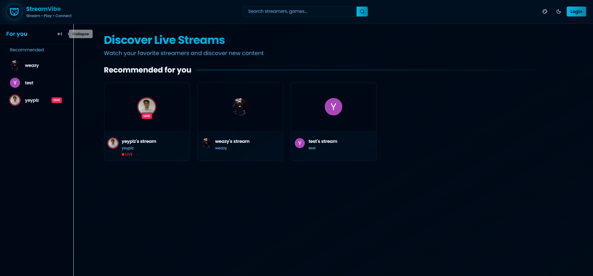
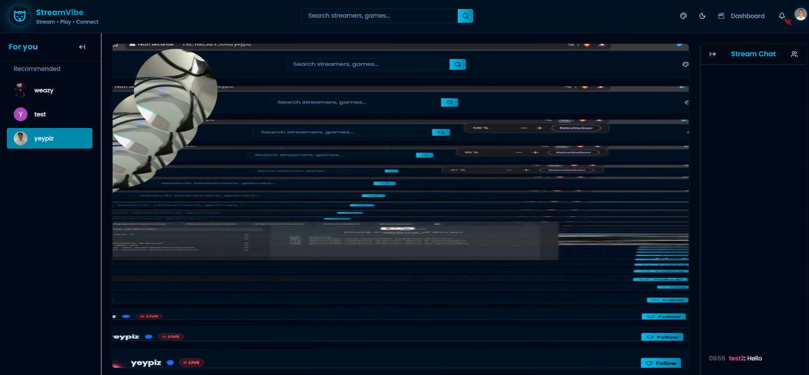
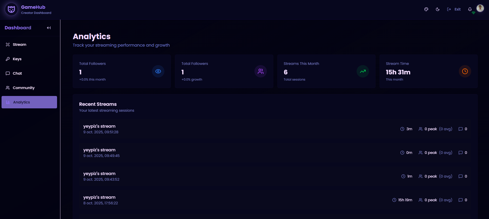

# StreamVibe 🎮

A modern, full-stack live streaming platform built with Next.js 15, featuring real-time chat, analytics, and seamless video streaming capabilities.


## 🌟 Overview

StreamVibe is a production-ready streaming platform that enables content creators to broadcast live, interact with their audience through real-time chat, and track their performance with comprehensive analytics. Built with modern web technologies and optimized for performance and scalability.

**🔗 Live Demo:** [https://streamvibe.teissieryannis.com/](https://streamvibe.teissieryannis.com/)

## ✨ Key Features

### 🎥 Live Streaming
- **Real-time Broadcasting:** RTMP ingestion via MediaMTX with HLS.js playback
- **Theater Mode:** Immersive full-screen viewing experience
- **Adaptive Quality:** Automatic quality adjustment based on network conditions
- **Multi-format Support:** Compatible with OBS Studio, Streamlabs, and other broadcasting tools

### 💬 Interactive Chat
- **Real-time Messaging:** WebSocket-powered chat using Pusher
- **Moderation Tools:** Block/unblock users, manage chat settings
- **Follower-only Mode:** Restrict chat to followers
- **Delayed Messages:** Optional message delay for moderation
- **Rich Features:** User mentions, emotes support, message history

### 📊 Analytics Dashboard
- **Viewer Metrics:** Real-time and historical viewer counts
- **Growth Tracking:** Follower growth over time with interactive charts
- **Stream Sessions:** Detailed logs of past streams with peak viewers
- **Engagement Stats:** Message counts, average watch time, viewer retention
- **Performance Insights:** Visual charts powered by Recharts

### 👥 Social Features
- **Follow System:** Follow your favorite streamers
- **Recommendations:** Personalized streamer recommendations
- **User Profiles:** Customizable profiles with bio and avatar
- **Community Management:** Block/unblock system for content creators
- **Notifications:** Real-time notifications for stream starts and interactions

### 🎨 Modern UI/UX
- **Dark/Light Mode:** System-aware theme with custom color schemes
- **Responsive Design:** Mobile-first approach, works on all devices
- **Theme Customization:** Customize primary and accent colors
- **Glassmorphism:** Modern glass effects and backdrop blur
- **Smooth Animations:** Framer Motion animations throughout
- **Accessibility:** ARIA labels, keyboard navigation, screen reader support

## 🛠️ Tech Stack

### Frontend
- **Framework:** Next.js 15 (App Router)
- **Language:** TypeScript 5
- **UI Library:** React 19
- **Styling:** TailwindCSS + Custom theme system
- **Components:** Custom UI components with Radix UI primitives
- **State Management:** Zustand
- **Real-time:** Pusher, HLS.js
- **Forms:** React Hook Form + Zod validation
- **Charts:** Recharts
- **Icons:** Lucide React

### Backend
- **Runtime:** Node.js
- **API:** Next.js API Routes (RESTful)
- **Database:** PostgreSQL
- **ORM:** Prisma
- **Authentication:** Clerk
- **File Upload:** UploadThing
- **Real-time:** Pusher Channels
- **Streaming:** MediaMTX (RTMP → HLS)

### Infrastructure
- **Hosting:** Vercel (Frontend + API)
- **Database:** Neon PostgreSQL
- **Media Server:** OVH VPS (MediaMTX)
- **CDN:** Vercel Edge Network
- **Monitoring:** Vercel Analytics

## 🚀 Getting Started

### Prerequisites

- Node.js 18+ and npm
- PostgreSQL database
- Clerk account (authentication)
- Pusher account (real-time features)
- UploadThing account (file uploads)
- MediaMTX server (streaming)

### Installation

1. **Clone the repository**
   ```bash
   git clone https://github.com/TeissierYannis/Twitch-Like
   cd Twitch-Like
   ```

2. **Install dependencies**
   ```bash
   npm install
   ```

3. **Set up environment variables**

   Create a `.env` file in the root directory:
   ```env
   # Database
   DATABASE_URL="postgresql://..."

   # Clerk Authentication
   NEXT_PUBLIC_CLERK_PUBLISHABLE_KEY="pk_..."
   CLERK_SECRET_KEY="sk_..."
   NEXT_PUBLIC_CLERK_SIGN_IN_URL="/sign-in"
   NEXT_PUBLIC_CLERK_SIGN_UP_URL="/sign-up"

   # Pusher (Real-time)
   NEXT_PUBLIC_PUSHER_KEY="..."
   NEXT_PUBLIC_PUSHER_CLUSTER="..."
   PUSHER_APP_ID="..."
   PUSHER_KEY="..."
   PUSHER_SECRET="..."

   # UploadThing
   UPLOADTHING_SECRET="sk_..."
   UPLOADTHING_APP_ID="..."

   # MediaMTX
   MEDIAMTX_RTMP_URL="rtmp://your-server:1935"
   NEXT_PUBLIC_MEDIAMTX_HLS_URL="https://your-server"
   ```

4. **Set up the database**
   ```bash
   npx prisma generate
   npx prisma db push
   ```

5. **Run the development server**
   ```bash
   npm run dev
   ```

6. **Open your browser**

   Navigate to [http://localhost:3000](http://localhost:3000)

### MediaMTX Configuration

1. Install MediaMTX on your server
2. Update `mediamtx.yml` with your webhook URL:
   ```yaml
   runOnReady: "curl -X POST https://your-domain.com/api/webhooks/mediamtx -H 'Content-Type: application/json' -d '{\"event\":\"publish\",\"path\":\"$MTX_PATH\"}'"
   runOnNotReady: "curl -X POST https://your-domain.com/api/webhooks/mediamtx -H 'Content-Type: application/json' -d '{\"event\":\"unpublish\",\"path\":\"$MTX_PATH\"}'"
   ```
3. Start MediaMTX:
   ```bash
   ./mediamtx
   ```

## 📁 Project Structure

```
streamvibe/
├── app/
│   ├── (auth)/              # Authentication pages
│   ├── (browse)/            # Public browsing pages
│   │   ├── [username]/      # Stream viewer page
│   │   ├── search/          # Search functionality
│   │   └── _components/     # Browse page components
│   ├── (dashboard)/         # Creator dashboard
│   │   └── u/[username]/    # Dashboard pages
│   │       ├── analytics/   # Analytics dashboard
│   │       ├── chat/        # Chat settings
│   │       ├── community/   # Community management
│   │       └── keys/        # Stream keys
│   └── api/                 # API routes
│       ├── analytics/       # Analytics endpoints
│       ├── chat/            # Chat endpoints
│       ├── notifications/   # Notification system
│       ├── streams/         # Stream management
│       └── webhooks/        # External webhooks
├── components/
│   ├── stream-player/       # Video player components
│   ├── notifications/       # Notification system
│   ├── accessibility/       # A11y components
│   └── ui/                  # Reusable UI components
├── hooks/                   # Custom React hooks
├── lib/                     # Utility functions & services
├── store/                   # Zustand state management
├── prisma/                  # Database schema
└── public/                  # Static assets
```

## 🎯 Core Features Deep Dive

### Real-time Stream Status
- Automatic detection when streamers go live/offline
- 30-second polling for live status updates
- Instant updates on stream viewer page via HLS manifest checks
- WebSocket fallback for guaranteed delivery

### Advanced Chat System
- Pusher presence channels for online user tracking
- Message persistence in PostgreSQL
- Rate limiting to prevent spam
- Rich text formatting support
- User @mentions functionality

### Analytics Engine
- Real-time viewer count tracking
- Historical data aggregation
- Peak viewership calculations
- Session-based analytics
- Interactive charts with drill-down capabilities

### Performance Optimizations
- Server-side rendering for SEO
- Static page generation where possible
- Image optimization with Next.js Image
- Code splitting and lazy loading
- Edge caching via Vercel CDN
- Database connection pooling

## 🔐 Security Features

- **Authentication:** JWT-based auth via Clerk
- **Authorization:** Role-based access control (RBAC)
- **API Security:** Rate limiting on all endpoints
- **Input Validation:** Zod schemas for all inputs
- **SQL Injection Prevention:** Parameterized queries via Prisma
- **XSS Protection:** React auto-escaping + Content Security Policy
- **CSRF Protection:** SameSite cookies + token validation

## 📈 Performance Metrics

- **Lighthouse Score:** 95+ on all metrics
- **First Contentful Paint:** < 1.5s
- **Time to Interactive:** < 3.5s
- **Core Web Vitals:** All green
- **Bundle Size:** Optimized chunks under 200KB

## 🧪 Testing

```bash
# Run type checking
npm run type-check

# Run linting
npm run lint

# Build for production
npm run build
```

## 📦 Deployment

### Vercel (Recommended)

1. Push your code to GitHub
2. Import the project in Vercel
3. Add environment variables
4. Deploy!

### Manual Deployment

```bash
npm run build
npm start
```

## 🤝 Contributing

Contributions are welcome! Please follow these steps:

1. Fork the repository
2. Create a feature branch (`git checkout -b feature/amazing-feature`)
3. Commit your changes (`git commit -m 'Add amazing feature'`)
4. Push to the branch (`git push origin feature/amazing-feature`)
5. Open a Pull Request

## 📸 Screenshots

### Homepage


### Live Stream


### Analytics Dashboard


---

<div align="center">
  <strong>Built with ❤️ using Next.js</strong>
</div>
